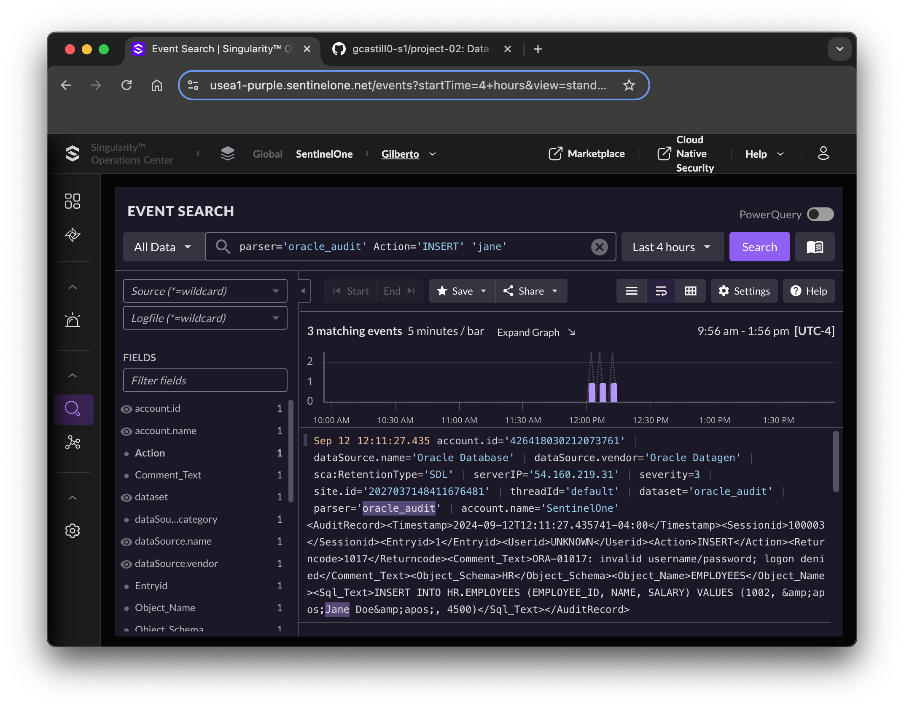

# Oracle Data Generator

The purpose of this project is to simulate Oracle Audit Events from a sample set gathered from multiple public sources. The generator interprets an audit event and converts to either a JSON or XML encoded message.

For instance, we are given an audit record in the Oracle log as follows:

```bash
TIMESTAMP: "2024-09-09 10:25:00"
SESSIONID: "100003"
ENTRYID: "1"
USERID: "UNKNOWN"
ACTION: "INSERT"
RETURNCODE: "1017"
COMMENT$TEXT: "ORA-01017: invalid username/password; logon denied"
OBJECT_SCHEMA: "HR"
OBJECT_NAME: "EMPLOYEES"
SQL_TEXT: "INSERT INTO HR.EMPLOYEES (EMPLOYEE_ID, NAME, SALARY) VALUES (1002, 'Jane Doe', 4500)"
```

The data generator reads the original item and formats the message as follows:

```xml
<AuditRecord>
    <Timestamp>2024-09-12T12:11:27.435741-04:00</Timestamp>
    <Sessionid>100003</Sessionid>
    <Entryid>1</Entryid>
    <Userid>UNKNOWN</Userid>
    <Action>INSERT</Action>
    <Returncode>1017</Returncode>
    <Comment_Text>ORA-01017: invalid username/password; logon denied</Comment_Text>
    <Object_Schema>HR</Object_Schema>
    <Object_Name>EMPLOYEES</Object_Name>
    <Sql_Text>INSERT INTO HR.EMPLOYEES (EMPLOYEE_ID, NAME, SALARY) VALUES (1002, &amp;apos;Jane Doe&amp;apos;, 4500)</Sql_Text>
</AuditRecord>
```

In the end, the data is sent to a SentinelOne raw ingestion API endpoint for processing. The intent is for the message to flow into the Singularity Data Lake and interpreted by the Singularity AI SIEM.



# Data Parser

In our generation process, we categorize the data with the `oracle_audit` source type. This is an arbitrary convention and you can modify as you see fit. To process the ingestion and interpret the meta data, we prepared a cursory [data parser](parser/oracle_audit_parser.json).

The parser extracts the XML keys and their corresponding values. These automated extractions emphasize search and analysis with the Singularity AI SIEM. For instance, the parser extracts the XML keys and values as follows:

| Field | Value |
------- | --------
| Action | INSERT |
| Comment_Text | ORA-01017: invalid username |
| Entryid | 1 |
| Object_Name | EMPLOYEES | 
| Object_Schema | HR
| Returncode | 1017 | 
| Sessionid | 100003 | 
| Sql_Text | INSERT INTO HR.EMPLOYEES (EMPLOYEE_ID, NAME, SALARY) VALUES (1002, &amp;apos;Jane Doe&amp;apos;, 4500) | 
| Timestamp | 2024-09-12T12:11:27.435741-04:00 | 
| Userid | UNKNOWN | 
| dataSource.category | Audit | 
| dataSource.name | Oracle Database | 
| dataSource.vendor | Oracle Datagen | 
| dataset | oracle_audit | 

---

# Getting Started

### 1. Working Directory

Navigate to the [eventgen](eventgen) folder.

### 2. Configuration

Configure your seetings under [config.json](eventgen/config.json). There are four important options to configure:

| Option | Description | Format |
| ------ | ----------- | ------ |
| sourcetype | The classification for the data | Change the URL option for `oracle_audit` to support your desired choice. 
| output_size | The amount of data to send | KB, MB and GB |
| time_range | Period of time to distribute the data | m, h, d |
| format | The format to send the data | xml, json |

Here is an example of the configuration to generate 10KB of data over a 20 minute period. 

```json
{
  "samples": "samples/audit_log.txt",
  "webhook_url": "https://ingest.us1.sentinelone.net/services/collector/raw?sourcetype=oracle_audit",
  "output_size": "10KB",
  "time_range": "20m",
  "format": "xml"
}
```

### 3. API Key

Express your Log Access Key with an environment variable. This key must provide `Write` permissions to your desired SentinelOne Site.

```bash
export AUTH_TOKEN="******HOVWe_Yf"
```

### 4. Run the generator

Use the following command to run the generator:

```bash
python3 eventgen.py
```

At the moment we output some simple messages to indicate action. The events are shipped over the period of time you indicate in the configuration. For the configuration above, you may see a number of messages like these:

```bash
Data successfully sent. Status code: 200
Sent 1 events, 359 bytes in 0 minute(s).
Data successfully sent. Status code: 200
Sent 2 events, 753 bytes in 0 minute(s).
...
...
Data successfully sent. Status code: 200
Sent 28 events, 9885 bytes in 17 minute(s).
Data successfully sent. Status code: 200
Sent 29 events, 10244 bytes in 19 minute(s).
```
